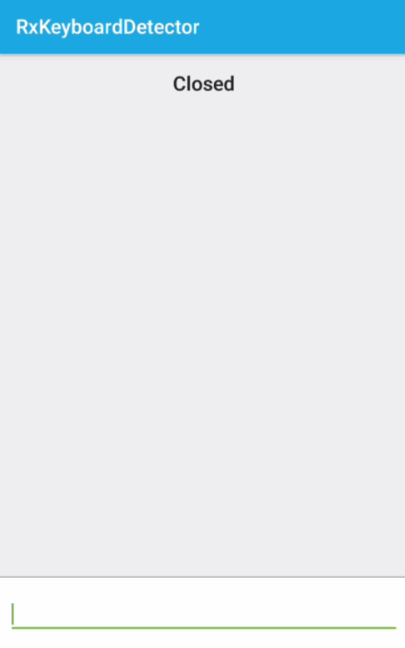

# Rx Keyboard Detector

[](https://circleci.com/gh/Kyash/rx-keyboard-detector/tree/master)
[](https://jitpack.io/#Kyash/rx-keyboard-detector)

Simple Android library to detect Keyboard `opened`/`closed` status by using RxJava2.



## Download

### Project build.gradle

```groovy
allprojects {
    repositories {
        ...
        maven { url "https://jitpack.io" }
    }
}
```

### App build.gradle

```groovy
dependencies {
    ...
    compile 'com.github.Kyash:rx-keyboard-detector:LATEST_VERSION'
}
```

`LATEST_VERSION` is  [](https://jitpack.io/#Kyash/rx-keyboard-detector)

## Usage
Super simple. Check example [MainActivity.kt](https://github.com/Kyash/rx-keyboard-detector/blob/master/example/src/main/java/co/kyash/rxkeyboarddetector/MainActivity.kt)

```kotlin
KeyboardDetector(this).observe().subscribe({ status ->
  when(status) {
    KeyboardStatus.OPENED -> {}
    KeyboardStatus.CLOSED -> {}
  }
})
```

## Dependencies
This library depends on RxJava2 and Kotlin

## Thanks
This library is inspired from these awesome code. Thank you so much!
- https://github.com/yshrsmz/KeyboardVisibilityEvent
- https://gist.github.com/andrewmunn/af4c15210dd376f69990eca672d2d0e7#file-keyboardmanager-kt

## Contributing
We are always welcome your contribution!
If you find a bug or want to add new feature, please raise issue.

## License

```
Copyright 2018 Kyash

Licensed under the Apache License, Version 2.0 (the "License");
you may not use this file except in compliance with the License.
You may obtain a copy of the License at

    http://www.apache.org/licenses/LICENSE-2.0

Unless required by applicable law or agreed to in writing, software
distributed under the License is distributed on an "AS IS" BASIS,
WITHOUT WARRANTIES OR CONDITIONS OF ANY KIND, either express or implied.
See the License for the specific language governing permissions and
limitations under the License.
```
